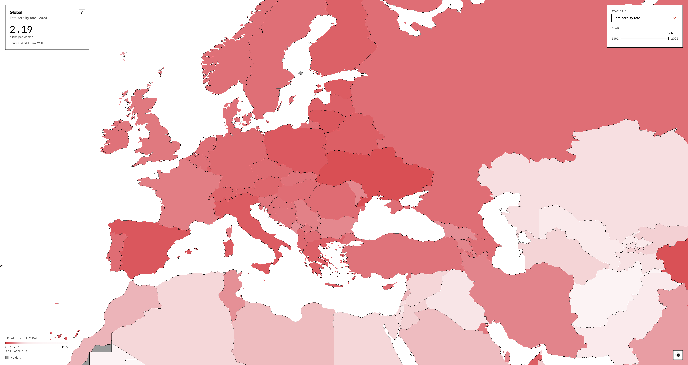
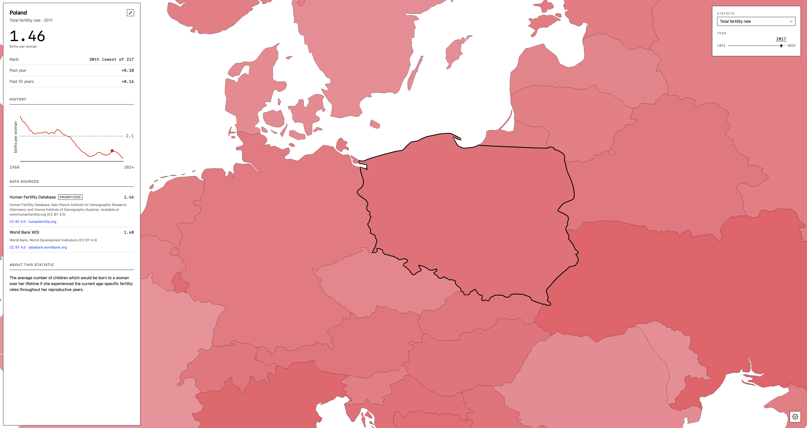

# Eafora

An interactive global atlas for fertility data.

Screenshots

Total fertility rate across the globe in 2024.

A single region's detail panel, showing its history, the sources behind the selected value, and how the statistic is defined.

